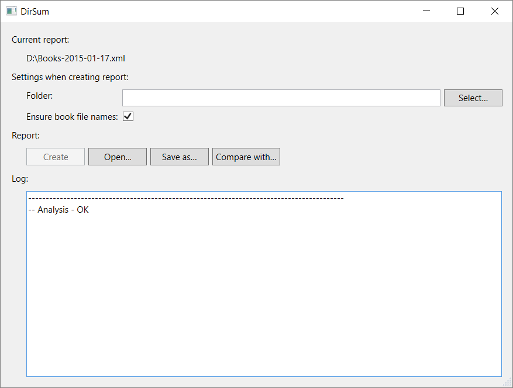

# DirSum

DirSum is a tool which manipulates with directory checksums.
In the following text the directory checksums are called reports.

A report for a directory `dir` contains a record for every
file in the directory `dir` and its subdirectories.
A record for a file `f` consits of

- the relative path to `f` wrt `dir`,
- the size of `f` in bytes
- and the SHA-1 hash of the contents of `f`.

DirSum can create reports, save reports to XML, load reports from XML,
analyze reports and compare reports.

## Creating a report

To create a report for `dir` select the folder `dir` and then click
the button *Create*. If *Ensure book file names* is checked
the program will at first verify whether the names of the files
in `dir` follow a certain pattern. For example
`Author - Book Name (2016).pdf` is a valid file name
becuase it follows the pattern (for more details on the pattern
see the function `isValidBookFileName` in `Report.fs`).
The report is created only if the optional validation of the file
names doesn't discover any invalid file names.

The newly created report is stored in memory. It can be saved to disk
(in XML format) using the *Save as…* button.
Saved reports can be loaded from disk using the *Open…* button.

## Analyzing a report

Newly created or opened reports are automatically
analyzed. The analysis discovers empty files and duplicates.

## Comparing two reports

The current report can be compared to another report using
the *Compare with…* button. The current report represents
a new state of the directory and another report represents
a previous state. The comparison consists of

- moved files,
- modified files,
- added files (files which are only in the current report)
- and deleted files (files which are only in another report).
